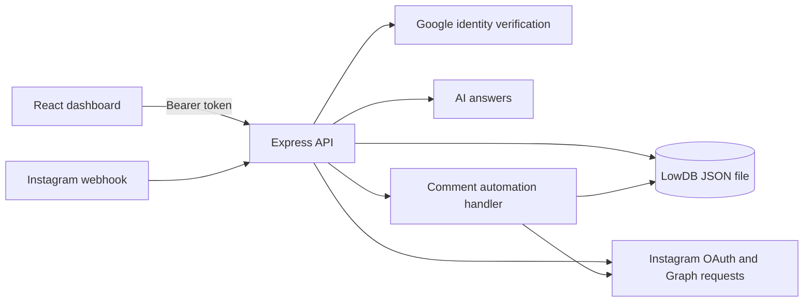

> **Historical note (v4):** This research document describes the original uploaded LowDB version. FlowVik v5 now uses Neon PostgreSQL; see `NEON_SETUP.md` and `ARCHITECTURE.md` for the current persistence layer.

# FlowVik / PingCheck Codebase Research

The repository implements a working foundation for Instagram comment-to-DM automation: authentication, workspace records, Instagram connection, comment matching, outbound replies, contact capture, and a React dashboard. It is a local SaaS starter with several substantial features, but the code does not yet support the full conversational automation platform described in the product specification. The highest-priority work is reliable persistence and webhook processing, followed by consistent account ownership, accurate analytics, and frontend runtime correctness.[^1][^2][^3]

This assessment covers the supplied source snapshot reviewed on September 9, 2026. Findings describe implementation behavior, not the status of a deployed service. Secret values, customer records, and runtime logs are excluded. Live Google, Instagram, and AI account operations were not exercised; external API compatibility, permissions, quota, and delivery remain unverified. No application source fixes are included in this report.

## Architecture and ownership

The root npm project contains two workspaces. The client is React 18 with React Router, Vite, React Flow, Recharts, and Lucide icons. The server is Express 5 with LowDB JSON persistence, Google token verification, built-in cryptography, and direct HTTP calls to external APIs. JavaScript is used throughout; there is no TypeScript configuration or frontend test suite in the supplied project.[^1][^4]

The browser communicates directly with the API using a bearer token from localStorage. `VITE_API_URL` controls the client API origin, defaulting to localhost port 4000. The backend loads root environment configuration and normally listens on port 4000; the Vite client uses port 5173. The production start script runs Express alongside Vite preview, so the current deployment arrangement remains closely tied to local development conventions.[^1][^4][^5]

Most routes and orchestration live in the 680-line `server/src/index.js`. Separate modules handle cryptography, Meta calls, comment execution, AI, metrics, automation organization, privacy content, and settings. Settings is the clearest example of a testable route module: it accepts injected persistence functions. The main API instead constructs the application and starts listening in the same module, making isolated HTTP tests harder.[^2][^6]

Each user has one authoritative `workspaceId`. Workspace member records also exist, but authentication derives scope from the user record rather than a selected membership. Most collection endpoints explicitly filter by workspace. Sessions and messages use indirect ownership through users and conversations; automation runs belong through automation IDs. These indirect relationships matter when deleting parent records or aggregating statistics.[^2][^3][^6]

## Main execution paths

Local signup validates basic fields, hashes the password with scrypt, creates a user and workspace, adds an owner membership, and creates a 30-day bearer session. Login compares credentials and issues a new session. Google sign-in verifies an identity token for the configured audience, then finds or creates a user using the Google subject or email. Logout removes the current session.[^2][^7]

Instagram connection begins at an authenticated endpoint. It rejects demo mode and incomplete configuration, creates signed OAuth state containing the workspace ID, and returns an authorization URL. The callback verifies state, exchanges the code and token, fetches a profile, attempts webhook subscription, and persists an encrypted token with account metadata. A subscription failure produces a connected account with a warning rather than discarding the connection.[^2][^8]

The comment webhook verifies the request signature, normalizes events, checks stored event IDs, writes fresh events, acknowledges receipt, and schedules comment execution using `setImmediate`. Execution finds the connected account, creates or updates a contact, logs activity, selects the first active matching automation, attempts a public reply, sends the private reply, and records the outcome. A public-reply failure is retained as a warning and does not prevent the private reply.[^2][^3][^8]

Matching supports account targeting, media targeting, organic/ad scope, an optional keyword, and exact or substring matching. Empty keywords match every comment at the engine level. The first matching automation wins according to array order; there is no explicit business-priority field. New automations are generally inserted at the front, so creation order can change which overlapping flow executes.[^2][^3]

The graph canvas saves nodes and edges, but the execution engine does not interpret them. Runtime behavior comes from flat fields such as `keyword`, `publicReply`, and `privateReply`. Changing connections on the canvas does not create conditional branching, delays, questions, or multistep execution. The editor also restores a primary trigger-to-message edge when those nodes exist.[^3][^9]

## Feature completeness

| Feature | Observed implementation | Practical boundary |
|---|---|---|
| Local and Google authentication | Server-side sessions and identity verification | No password-reset or email-verification flow found |
| Instagram connection | OAuth, profile, token storage, webhook subscription, media pagination | No token refresh worker found |
| Comment-to-DM | Keyword and target matching, public/private replies, run records | One flat reply flow; no durable execution queue |
| Automation library | Create, edit, publish, pause, folders, trash/restore | Canvas is not an executable graph |
| Overview dashboard | Metrics derived from recorded messages and completed runs | All-time snapshot rather than historical reporting |
| Analytics | Generated seven-day series and top-five stored counters | Does not provide trustworthy historical activity |
| Inbox | Displays conversation records made by successful automations | Incoming DM events are not materialized; manual replies disabled |
| Contacts | List, search, add, delete | No complete lifecycle or cascading individual deletion |
| AI chat | Server-controlled request with limited workspace context | No action tools or knowledge retrieval |
| Quick automation draft | Keyword-based local text generation | Not an AI inference operation |
| Knowledge base | Stores text sources | No retrieval integration; effect lifecycle bug |
| Team | Displays members and stores pending invitations | No delivery or acceptance flow found |
| Settings | Validated preferences, draft cloning, template export, owner deletion | Owner enforcement is not consistent across all API routes |
| Campaigns | Backend list/create draft records | No campaign page route or delivery worker |

This inventory follows the source and routing rather than the aspirational product specification. That document describes a substantially broader platform and even lists a different intended framework stack; it should be treated as a roadmap, not an implementation inventory.[^1][^2][^4][^6][^9][^10][^11]

## Prioritized findings

**1. High: concurrent database operations can lose updates.** `mutate()` reads the entire file into shared `db.data`, invokes a mutator, then writes. It does not serialize that complete sequence. An overlapping read can replace the in-memory object with an older snapshot after another request has changed it. The installed LowDB implementation explicitly replaces `this.data` on reads; atomic file replacement does not provide transaction isolation.[^12]

An isolated reproduction used the actual `mutate` function body with an asynchronous snapshot adapter. Two simultaneous appends expected `["A", "B"]` but persisted `["B"]`. This demonstrates the application-level race under a valid interleaving without touching the live database. Login, webhook handling, UI updates, and five-second dashboard polling all share this storage layer. Serialize reads and writes consistently as an immediate local measure; use transactional persistence for concurrent deployment.

**2. High: accepted webhook events can be lost permanently.** The endpoint stores an event as seen and returns HTTP 200 before its `setImmediate` handler completes. A process exit between acknowledgment and execution leaves an event that redelivery will suppress. Failures are recorded, but no durable pending state, recovery scan, or automatic retry worker is present. Use a durable event/job record with processing status and startup recovery. Outbound delivery needs separate attempt tracking because a timeout can occur after an external send succeeds.[^2][^3]

**3. High: duplicate webhook events are not claimed atomically.** Deduplication builds a set from previous events and filters a batch without adding newly accepted IDs to that set. An isolated normalization/filter check accepted two identical comment events from one payload as two fresh events. Concurrent requests can also both pass the pre-write check. Both handlers may attempt public and private replies. Enforce an atomic uniqueness rule using account, event type, and external ID, plus an execution claim; verify behavior against the supported upstream event contract.[^2][^8]

**4. High: connecting the same Instagram identity in two workspaces creates ambiguous routing.** The callback removes an existing account only within the callback workspace. The automation handler later finds the first account globally by Instagram user ID. Since connections are prepended, connecting that identity elsewhere changes which workspace receives subsequent processing. This is a confirmed mismatch in lookup rules, not evidence that an unauthorized person can connect an Instagram account without authorization. Decide whether ownership must be unique or whether explicit multi-workspace dispatch is supported, then enforce that decision consistently.[^2][^3]

**5. High correctness impact: Analytics invents activity.** `/api/analytics` produces nonzero series values whenever the workspace has any automation, including a draft with no executions. Values are formulas such as `120 + i * 37 + (i % 2) * 44`. The UI labels the chart “LAST 7 DAYS.” Its total cards sum only the five returned top automations, while Overview calculates recorded metrics using a different path. Replace the synthetic series with dated run aggregation and return workspace totals separately from rankings.[^2][^10][^13]

**6. Medium: Knowledge returns a Promise from a React effect.** `Knowledge.jsx` defines `load` as a promise-returning function and passes it directly to `useEffect(load, [])`. The installed React DOM runtime expects the returned value to be a cleanup function and invokes it during cleanup. The application enables StrictMode, exposing this invalid lifecycle pattern during development cleanup as well as navigation. This is source-confirmed; no browser reproduction was run. Wrap the call in an effect that returns either nothing or an actual cleanup callback.[^11][^14]

**7. Medium: creating an automation overwrites intentional empty fields.** The creation route uses `req.body?.keyword || 'PRICE'` and a similar expression for the public reply. Leaving the keyword blank as instructed by the builder creates a PRICE trigger instead of an all-comments trigger. Disabling the public reply by clearing its text restores the default public message. Updating an existing record preserves these empty values, so create and update differ. Apply defaults only for absent values and validate types explicitly.[^2][^9]

**8. Medium, conditional: reconnection breaks automations bound to database account IDs.** The matcher accepts both external Instagram IDs and local account IDs. The callback creates a fresh local ID on every reconnection and deletes the old local account record without updating references. Current editor paths normally save the external ID, so those flows avoid this failure; legacy records and direct API clients using the supported local ID can stop matching. Preserve the local ID during reconnection or migrate references atomically.[^2][^3][^9]

**9. Medium: incoming messages are accepted but never reach the inbox.** Normalization produces `MESSAGE` events and the webhook stores them, but its execution loop dispatches only `COMMENT` events. No path converts incoming DMs into conversations and messages. Inbox is therefore an automation transcript viewer rather than a synchronized Instagram inbox. Its search field also has no filtering behavior and the composer is explicitly disabled.[^2][^8][^15]

**10. Medium: role enforcement is inconsistent.** The settings router checks owner membership, but the separate `PUT /api/workspace` route changes the workspace name with authentication alone. Most other mutation endpoints also have no role checks, and team invitations accept a submitted role without an allowlist. Existing signup creates owners and invite acceptance is absent, limiting current ordinary-user exposure. Nevertheless, lower-privilege members supplied through migration or future membership features would not receive the protection suggested by the role labels.[^2][^6]

**11. Medium: production configuration can silently use development security defaults.** Without an encryption key, token storage uses a `plain-dev:` prefix even when demo mode is false. OAuth state uses a known fallback signing secret if `SESSION_SECRET` is absent. Signature validation permits missing app secrets in demo mode. These are source-level defaults, not claims about the current `.env`. Production startup should validate mandatory secrets and refuse insecure fallback configurations.[^7][^16]

**12. Medium: tokens have recorded expiry but no renewal path.** The callback stores `tokenExpiresAt`, but no refresh scheduler or refresh API implementation was found. Meta requests also lack explicit timeouts, unlike the AI request. A stored connection flag therefore does not establish that later requests will succeed. Add token lifecycle state, bounded requests, and reconnect guidance; verify renewal behavior against the relevant Meta API before implementation.[^2][^8]

**13. Medium: authentication lacks abuse controls.** Sessions contain plaintext bearer tokens and live for 30 days, while login uses synchronous scrypt on the server event loop without a login rate limiter. Signup has a six-character minimum and no verification workflow. A token copied from storage can authenticate until invalidation or expiry; repeated expensive credential checks can contend with normal work. These are defensive design gaps, not a demonstrated exploit against this installation.[^2][^5][^7]

**14. Lower priority: deletion and secondary metrics leave inconsistencies.** Deleting a contact leaves conversations, messages, and automation runs referencing it. Permanently deleting an automation leaves its runs, which are no longer reachable through the settings deletion cascade's current automation-ID set. Existing conversations do not have `lastMessageAt` updated on subsequent successful replies. The AI context uses stored counters and includes records filtered out by Overview, so AI answers may disagree with the dashboard. Consolidate metric definitions and establish explicit cascade or archival rules.[^2][^3][^6][^13][^17]

## Security strengths and remaining boundaries

Several safeguards are already present. Password creation uses salted scrypt. Sessions use cryptographically random tokens and server-side expiry checks. When configured, token encryption uses AES-256-GCM. Webhook verification uses an HMAC and constant-time comparison. Most API reads and writes scope records to the authenticated workspace, and media retrieval validates account ownership before decrypting its token.[^2][^7]

AI requests restrict client message roles to user and assistant, limit message size/count, set a timeout, use server-controlled instructions, and exclude contact details, inbox content, integration tokens, and knowledge sources from the constructed snapshot. The model receives no tools for changing application state. The route applies an in-process workspace concurrency and request-rate limit. These controls are directly visible in the implementation; they do not establish external service availability.[^2][^17]

Further validation should cover malformed JSON field types, OAuth replay, membership revocation, and consistent authorization. OAuth state has a timestamp and random component but no consumed-state record; its verifier does not reject future or nonnumeric timestamps explicitly. Exploiting malformed signed state would still require the signing capability, so this should not be described as a standalone authentication bypass.[^8]

## Verification and confidence

| Check | Result | What it establishes |
|---|---|---|
| `npm.cmd test` | 16 passed, 0 failed | Existing AI, media, Meta request, dashboard, organization, and settings tests pass |
| `npm.cmd run check` | Passed | Syntax of the five modules listed in the root script is valid |
| `npm.cmd run build` | Passed after filesystem access retry | Vite compiled the frontend successfully |
| Concurrent mutation reproduction | Expected two records; persisted one | Shared read-modify-write logic can lose an update under overlap |
| Duplicate batch reproduction | Two accepted events; one unique ID | Deduplication does not remove duplicates inside one payload |
| Browser interaction tests | Not performed | Runtime rendering, navigation, and accessibility remain unverified |
| Live provider tests | Not performed | OAuth, webhook delivery, actual sends, and AI answers remain unverified |

The frontend build transformed 2,361 modules and emitted one JavaScript asset of 864.94 kB, 253.52 kB gzip. Vite warned that the chunk exceeded 500 kB. Routes are eagerly imported; route splitting could defer the graph editor and chart dependencies. A successful build does not execute React effects and therefore does not clear the Knowledge lifecycle finding.[^4][^14]

The existing tests include useful workspace isolation and data-exclusion cases. However, the main authentication endpoints, complete webhook ingestion/execution path, persistence concurrency, account reconnection, and frontend lifecycle are not covered by those 16 tests. Passing tests therefore support the tested helpers and settings API, not end-to-end production readiness.[^18]

## Recommended implementation sequence

First stabilize storage and event processing. Serialize database access for the local architecture, add atomic event claims and recoverable processing states, and define the rule for Instagram ownership across workspaces. Verify those changes with deterministic concurrent-request and restart-recovery tests before increasing webhook traffic.

Next resolve the immediate correctness issues: Knowledge effect cleanup, empty-value creation semantics, stable reconnection identity, and real analytics. These are bounded changes with clear expected outcomes. Align Overview, Analytics, automation rankings, and AI context on one definition of recorded runs and unique leads.

Then harden configuration and authorization. Enforce required production secrets, apply route-wide role checks, add authentication throttling, and define session revocation and token renewal behavior. Introduce common request schemas so invalid field types cannot be stored and later break rendering or execution.

Finally complete product features deliberately. Prioritize incoming-message ingestion and inbox synchronization if conversational automation is the goal. Add invitation acceptance before presenting team roles as functional access control. Either implement a graph interpreter or make the fixed comment/reply model explicit in the editor. Keep knowledge retrieval, campaigns, and multistep lead capture on the roadmap until their execution paths exist.

## Sources

All citations refer to local primary sources in the supplied repository. Line locations identify useful entry points; related logic in the same file is included where discussed. The observations concern this snapshot rather than current external API documentation.

[^1]: [Root package and scripts](../package.json); [README](../README.md); [product specification](product-spec.md).
[^2]: [Express API and orchestration](../server/src/index.js), especially authentication at lines 63–205, automation APIs at 259–337, analytics at 371–380, OAuth at 529–587, and webhook ingestion at 620–640.
[^3]: [Comment matcher and executor](../server/src/automation.js), matcher at line 12 and execution at line 35.
[^4]: [Client dependencies](../client/package.json); [client routes](../client/src/App.jsx); [Vite configuration](../client/vite.config.js).
[^5]: [Browser API wrapper](../client/src/api.js); [layout and session handling](../client/src/components/Layout.jsx).
[^6]: [Settings router and ownership checks](../server/src/settings.js), lines 21–98.
[^7]: [Security helpers](../server/src/security.js), encryption at line 13, passwords at line 35, signatures at line 55.
[^8]: [Meta integration](../server/src/meta.js), OAuth state, token/profile requests, media, outbound replies, and webhook normalization.
[^9]: [Graph editor](../client/src/pages/AutomationEditor.jsx); [Instagram setup editor](../client/src/pages/InstagramSetup.jsx); [template picker](../client/src/components/TemplatePicker.jsx).
[^10]: [Analytics page](../client/src/pages/Analytics.jsx); [team page](../client/src/pages/Team.jsx).
[^11]: [Knowledge page](../client/src/pages/Knowledge.jsx), line 6.
[^12]: [Persistence wrapper](../server/src/db.js), lines 25–44; installed `node_modules/lowdb/lib/core/Low.js` and `node_modules/lowdb/lib/adapters/node/TextFile.js` (local dependency source).
[^13]: [Recorded dashboard metrics](../server/src/dashboard.js).
[^14]: [React application entry](../client/src/main.jsx); installed `node_modules/react-dom/cjs/react-dom.development.js`, cleanup invocation at line 22971 and effect-return validation around line 23229 (local dependency source).
[^15]: [Inbox page](../client/src/pages/Inbox.jsx).
[^16]: [Environment configuration defaults](../server/src/config.js); [demo setup](../server/src/setup.js); [ignore rules](../.gitignore).
[^17]: [AI context and request construction](../server/src/ai.js); [AI chat component](../client/src/components/AiChat.jsx).
[^18]: [AI tests](../server/test/ai.test.js), [automation organization tests](../server/test/automation-library.test.js), [dashboard tests](../server/test/dashboard.test.js), [media tests](../server/test/media.test.js), [Meta tests](../server/test/meta.test.js), [settings tests](../server/test/settings.test.js).
